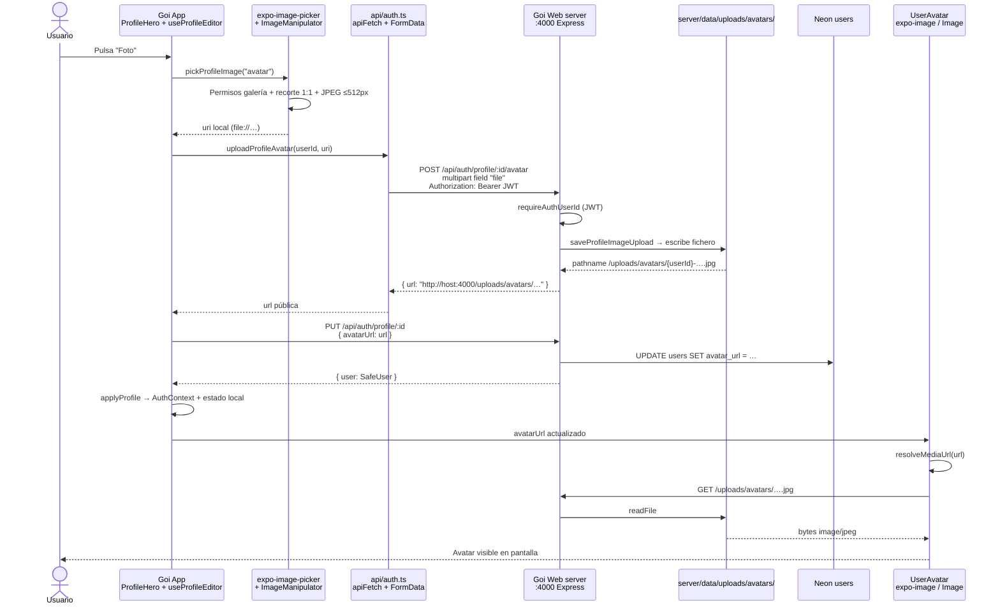

# Flujo de subida de imágenes (Goi App)

Documento de la **Fase 8 práctica** (autenticación, datos por usuario y almacenamiento en la nube), adaptado a la arquitectura real de **Goi**.

En el temario del curso (NoteFlow) el flujo termina consumiendo una **URL de AWS S3**. En Goi el papel equivalente lo cumplen:

| Temario (NoteFlow) | Goi |
|--------------------|-----|
| Firebase Auth | JWT + `SecureStore` (`api/session.ts`, Goi Web `server/` → `/api/auth/login`) |
| Firestore (perfil) | **Neon / PostgreSQL** (`users.avatar_url`, …) vía Goi Web `server/` |
| AWS S3 (objeto + URL pública) | **Disco del servidor** bajo `server/data/uploads/` + ruta HTTP `/uploads/...` |

La app **nunca** escribe directo en la base de datos ni en el disco: todo pasa por **Goi Web → `server/`** (Express, puerto `:4000`).

---

## Caso principal: foto de perfil (“Foto” / subir avatar)

Botón en pantalla: **Perfil → editar → `ProfileHero` → “Foto”** (`accessibilityLabel`: “Cambiar foto de perfil”).

### Diagrama de flujo

### Pasos detallados

| # | Qué ocurre | Dónde en código |
|---|------------|-----------------|
| 1 | Usuario pulsa **Foto** | `components/profile/ProfileHero.tsx` → `onChangeAvatar` |
| 2 | Hook de edición | `hooks/useProfileEditor.ts` → `uploadImage("avatar")` |
| 3 | Galería + compresión | `utils/profileImagePick.ts` → `pickProfileImage` (JPEG, máx. 512 px) |
| 4 | Multipart al servidor | `api/auth.ts` → `uploadProfileAvatar` → `POST /auth/profile/:userId/avatar` |
| 5 | Auth + guardar fichero | `Goi Web/server/src/controllers/authController.ts` → `uploadProfileAvatarFile` |
| 6 | Escritura en disco | `Goi Web/server/src/services/profileUploads.ts` + `middleware/profileImageUpload.ts` |
| 7 | Respuesta con URL | `buildPublicAssetUrl` → p. ej. `http://192.168.x.x:4000/uploads/avatars/…` |
| 8 | Persistir URL en perfil | `updateProfile` → `PUT /api/auth/profile/:userId` con `{ avatarUrl }` |
| 9 | Base de datos | Postgres / store según despliegue (`users.avatar_url`) |
| 10 | UI actualizada | `applyProfile` → `AuthContext.updateSessionUser` |
| 11 | Mostrar imagen | `UserAvatar` → `resolveMediaUrl(src)` → GET `/uploads/avatars/….jpg` |
| 12 | Servir bytes | Express sirve `server/data/uploads/` en `/uploads/…` |

### Formato de la URL (equivalente a S3)

- **Tras subir:** URL absoluta devuelta por la API, p. ej.  
  `http://127.0.0.1:4000/uploads/avatars/{userId}-{timestamp}-{random}.jpg`
- **En base de datos:** se guarda esa URL (o la ruta relativa según el campo).
- **En el móvil:** `resolveMediaUrl()` (`api/config.ts`) reescribe `localhost` del PC a la IP del dispositivo cuando hace falta (Expo Go en LAN).

Eso es lo mismo conceptualmente que **subir a un bucket y consumir la URL pública del objeto**, solo que el “bucket” es la carpeta `uploads/` del servidor Goi.

---

## Caso secundario: fotos en publicaciones

Mismo patrón (multipart → disco → URL → pantalla), con rutas distintas:

| Paso | Perfil (avatar) | Publicación (post) |
|------|-----------------|---------------------|
| Origen UI | `ProfileHero` → `useProfileEditor` | `CreatePostScreen` → `useCreatePostForm` |
| Preparación imagen | `utils/profileImagePick.ts` | `utils/postImage.ts` + `hooks/usePostImageAssets.ts` |
| Upload API | `POST /api/auth/profile/:id/avatar` | `POST /api/posts` (multipart `files[]`) |
| Disco | `server/data/uploads/avatars/` | `server/data/uploads/posts/{postId}/` |
| Persistencia metadata | `users.avatar_url` | `posts.media` (JSON `{ type, url }`) |
| Visualización | `UserAvatar` | `PostMediaCarousel` / `PostFeedImage` + `utils/postMedia/` |

Servidor: `Goi Web/server/src/services/profileUploads.ts`, `postsController.ts`, rutas en `server/src/routes/`.

---

## Cabecera de perfil (banner)

Idéntico al avatar, con:

- Botón: menú del héroe → cambiar cabecera (`ProfileHeroActionsMenu`).
- Recorte **3:1**, ancho máx. 1600 px.
- `POST /api/auth/profile/:userId/banner` → `uploads/banners/`.
- Campo en BD: `users.banner_url`.
- Visualización: `ProfileHero` → `Image` + `resolveMediaUrl(bannerUrl)`.

---

## Seguridad y permisos

- **Subir avatar/banner:** JWT obligatorio; solo el propio `userId` (`403` si no coincide).
- **Leer `/uploads/...`:** ruta pública GET (sin token); adecuado para avatares y media de posts públicos.
- **Límites:** avatar/banner ≤ 2 MB; posts ≤ 4 MB; tipos `jpeg`, `png`, `webp`.

---

## Cómo probar el flujo completo

1. Arrancar **Goi Web server:** en `Goi Web/server`, `npm run dev` (puerto `:4000`).
2. Arrancar **Goi App** (Metro); en móvil físico, IP en `EXPO_PUBLIC_API_URL` o QR en LAN.
3. Iniciar sesión → **Perfil** → editar → **Foto** → elegir imagen.
4. Comprobar en red del dispositivo:
   - `POST …/api/auth/profile/{id}/avatar` (multipart)
   - `PUT …/api/auth/profile/{id}` con `avatarUrl`
   - `GET …/uploads/avatars/….jpg` (200, `image/jpeg`)
5. Ver avatar en perfil, feed (posts propios) y perfil ajeno.

---

## Equivalencia con la consigna del curso

> *“Documentar el diagrama de flujo desde que el usuario hace click en ‘Subir foto’ hasta que la imagen aparece en pantalla consumiendo la URL de AWS.”*

En Goi:

1. **Click “Subir foto”** → botón **Foto** en `ProfileHero`.
2. **Subida a almacenamiento en la nube** → Goi Server escribe en `uploads/` (sustituto de S3 en desarrollo).
3. **URL pública** → respuesta `{ url }` + guardado en Postgres.
4. **Imagen en pantalla** → componente `UserAvatar` hace GET a esa URL vía `resolveMediaUrl`.

En **producción** se podría cambiar la capa de almacenamiento (S3, R2, etc.) manteniendo el mismo contrato: la API devuelve una URL y la app la consume; no haría falta cambiar la UI.

---

## Referencias rápidas

| Capa | Archivos clave |
|------|----------------|
| App — UI | `components/profile/ProfileHero.tsx`, `components/ui/UserAvatar.tsx` |
| App — lógica | `hooks/useProfileEditor.ts`, `utils/profileImagePick.ts` |
| App — HTTP / media | `api/auth.ts`, `api/client.ts`, `api/config.ts`, `utils/postMedia/` |
| Server — API | `Goi Web/server/src/routes/authRoutes.ts`, `controllers/authController.ts` |
| Server — storage | `server/src/services/profileUploads.ts`, `services/uploadPaths.ts` |
| Server — posts | `server/src/controllers/postsController.ts`, `middleware/profileImageUpload.ts` |
| BD | tabla `users` (`avatar_url`, `banner_url`); posts con JSON `media` |
